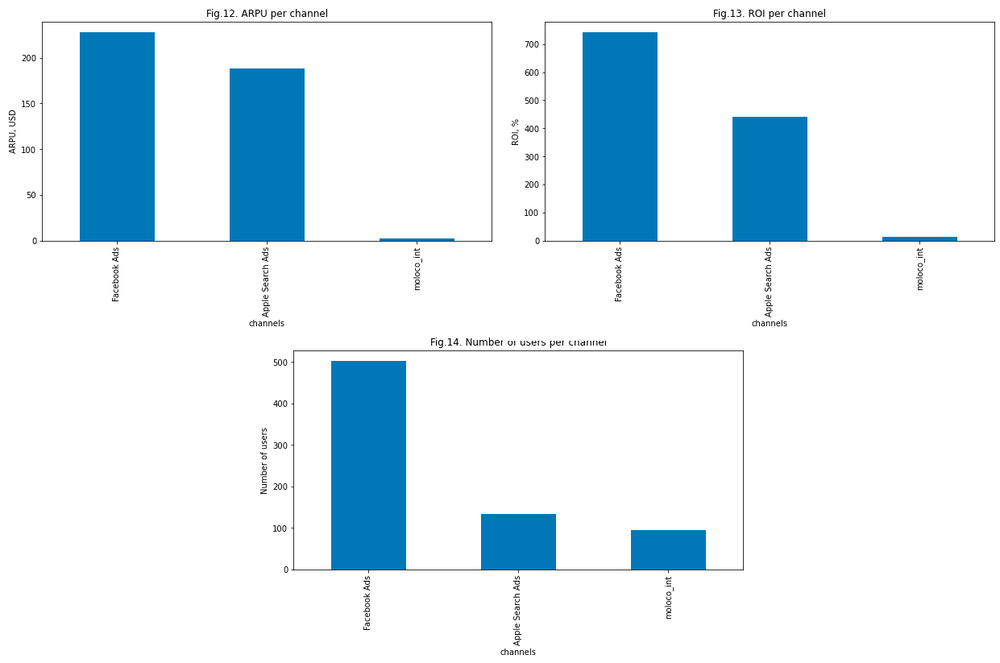

# Анализ рекламных кампаний для геймдев студии за 2021 год

:dart:**Цель:** анализ эффективности проведенных маркетинговых кампаний за 2021 год.

:memo:**Задачи:**
1. определить итоговые результаты проведения каждой рекламной кампании
2. посчитать метрики эффективности для каждой кампании
3. определить наиболее эффективный канал, географию и платформу

**Стек:** Python(pandas, numpy, matplotlib, plotly), SQL

:grey_exclamation:**Каждая задача решена как на Python, так и на SQL.**

**Исходные данные:** датасет из двух таблиц с данными о проведении рекламных кампаний за определенный период времени. 

1 таблица - события установки приложения и платежа по пользователям, которых удалось привлечь в рамках кампаний

2 таблица - маркетинговые затраты на привлечение.

**Подготовка данных:**
- Проведено форматирование значений и названий столбцов
  - расходы в таблице cost были переведены из центов в доллары
  - скорректировано название столбца: убран пробел в конце строки
  - значения стобца platform переведены в нижний регистр, чтобы в обеих таблицах была одинаковая запись
  - изменен формат чисел
- Добавлены пропущенные записи, которые пропали в следствие сбоев при сборе информации
- Получена общая информация о таблицах:
  - Данные за период с 01.01.2021 по 31.12.2021
  - уникальных установок - 730
  - уникальных платежей - 105
  - всего запускалось 6 кампаний
  - использовано 3 канала: 'Apple Search Ads', 'Facebook Ads', 'moloco_int'
  - в таблице cost 226 стран, в таблице events - 70
  - всего в таблице events 8219 событий

 ### :white_check_mark:**1.Определить итоговые результаты проведения каждой рекламной кампании**

Данные были сгруппированы по кампаниям и для каждой вычислены уникальные установки и плательщики, суммарные затраты, суммарная выручка, количество платежей привлеченных пользователей.

Для наглядности, результаты были представлены в виде графиков

Таким образом, кампании под номерами 1, 2 и 4 оказались наиболее успешными, на них приходится большая доля установок и покупок
Компании 3, 5 и 6 оказались неуспешными. Бюджеты на рекламу самые низкие, доходов практически нет. Хотя, количество установок не сильно меньше, чем у других кампаний.

### :white_check_mark:**2.Посчитать метрики эффективности для каждой кампании**

Были расчитаны следующие метрики: ROI, Конверсия (CR) в покупку, Стоимость конверсии (CPA) в покупку, ARPU

По окупаемости инвестиций(ROI) кампании 3, 5, 6 не окупились, средства потрачены не эффективно. Кампании 1, 2 и 4 окупились и принесли прибыль. 

Для ARPU наблюдается четкая зависимость от ROI. У кампаний с высоким ROI(кампании №1, №2 и №4) выше доход с пользователя, и наоборот, ARPU ниже у кампаний с низким ROI(кампании №3, №5, №6).

У кампаний 5 и 6 коэффциент конверсии на ровне с более успешными кампаниями, но доход с них маленький.

Для кампаний 5 и 6 также наблюдается ниже стоимость конверсии (CPA), что связано с относительно меньшими затратами и высокой конверсией.

Наиболее низкий коэффициент конверсии у 3 кампании. Поэтому и стоимость конверсии там больше.

### :white_check_mark:**3.Определить наиболее эффективный канал, географию и платформу**

:large_orange_diamond: канал

   

   Facebook Ads оказался наиболее эффективным каналом привлечения клиентов. Так как инвестиции окупились более чем на 700%, на него пришлось в 3 раза большее количество привелчённых пользователей и средний доход с пользователя больше
    
:large_orange_diamond: география
  
   количество стран в таблицах cost и events не совпадает. поэтому были получены данные только для 70 стран, которые есть в таблице events.

   

   Выбор страны с более эффективными результатами маркетинговой кампании зависит от целей
   Но в серднем по количеству пользователей, по их активности, окупаемости инвестиций и средней стоимости затрат, в США маркетинговая кампания прошла наиболее эффективно

:large_orange_diamond: платформа
  
   

   Если целью было получить больше дохода с пользователй, то эффективой платформой для этого стал Android. Так как ROI составил 900%, меньше стоимость привлечения клиентов, а доход с клиента больше, чем у IOS. Также ниже стоимость конверсии в покупку.
   Есди же важно было увеличить количество пользователей, то на IOS маркетинговая кампания принесла лучше результаты. Больше количество конверсий в покупку и немногим больше количество пользователей.
